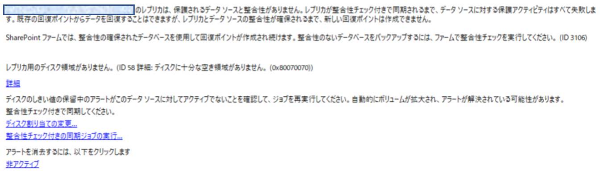
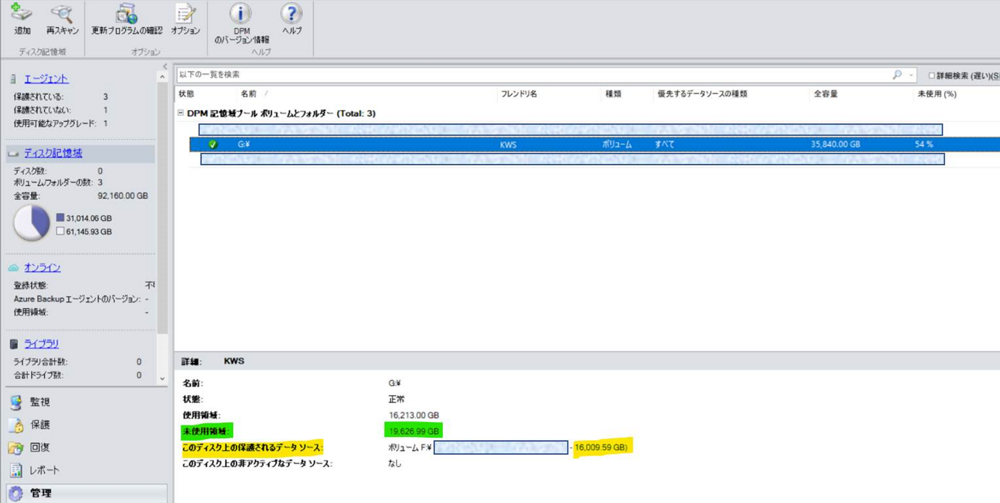
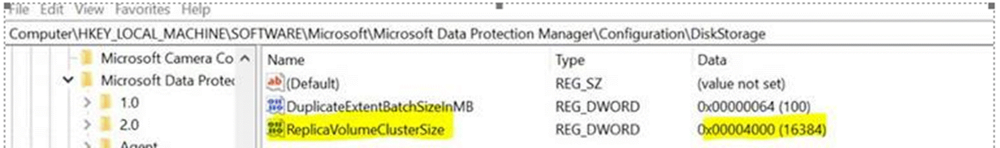

<!-- more -->
皆様こんにちは、Microsoft Azure Backup ＆ Recovery Services サポートです。 
DPM (Data Protection Manager) や MABS (Microsoft Azure Backup Server) を使用し、ファイルサーバーなどサイズの大きい保護対象をバックアップすることはよくあることです。 
今回は、データサイズが 16 TB 前後の保護対象をバックアップした際に、ID 58「ディスクに十分な空き領域がありません」のエラーでバックアップジョブが失敗する事象が発生する場合の、その原因と対処方法についてお伝えします。 

<エラーの抜粋> 

## 目次
-----------------------------------------------------------
[1. 【原因】](#1)
[2. 【対処方法】](#2)
-----------------------------------------------------------

## 1. 【原因】
データ保存先のディスク記憶域ボリュームの空き領域を確認したところ、十分な「未使用領域」があるのに、なぜ ID 58 にて「ディスクに十分な空き領域がありません」のエラーが発生することがあるのでしょうか。 

【原因】 
原因として、DPM/MABS が作成するレプリカのサイズは、デフォルトで 16 TB までしか拡張することができないためです。
保護対象のデータサイズが約 16 TB に達すると、DPM/MABS はバックアップするためにレプリカのサイズを 16 TB 以上に拡張します。 
しかし、NTFS ファイルシステムのデフォルトのレプリカクラスターサイズは 4 K 、サポートされる最大ボリュームのサイズは 16 TB となっています。
そのため拡張が失敗し、「ディスクに十分な空き領域がありません」のエラーでバックアップ失敗します。 
 
＜NTFSのクラスター サイズと最大ボリューム一覧表＞ 
https://docs.microsoft.com/ja-jp/windows-server/storage/file-server/ntfs-overview#support-for-large-volumes

上記エラーを解消するためには、まず下記をお試しください。

## 2. 【対処方法】
保護グループを作成する前に、保護対象のサイズが将来的に 16 TB を超える可能性がある場合、あらかじめ下記の方法でデフォルトのレプリカクラスターサイズを変更してから、保護グループを作成することを強く推奨します。 

##### デフォルトのレプリカクラスターサイズを変更する方法
DPMサーバーにて、下記レジストリエントリを追加します。 

>Computer\HKEY_LOCAL_MACHINE\SOFTWARE\Microsoft\Microsoft Data Protection Manager\Configuration\DiskStorage 
>ReplicaVolumeClusterSize REG_DWORD 
>REG_DWORD 
>0x00004000(16384) 
 
＜設定サンプル＞ 

0x00002000 (8192) に設定する場合、最大ボリュームのサイズ上限は 32 TB になります。 
0x00004000 (16384) に設定する場合、最大ボリュームのサイズ上限は 64 TB になります。 

もし、すでにデフォルトのレプリカクラスターサイズが 4 K の環境で、保護グループを作成している場合、レプリカのサイズを 16 TB 以上に拡張するためには、下記手順で保護グループをいったん削除してから、再作成していただく必要があります。 
 
１．問題が発生したバックアップの保護グループを削除する (バックアップ データも削除)
２．DPM サーバーにて、デフォルトのレプリカクラスターサイズを変更 
３．新しい保護グループを作成し、バックアップ実施する 

ご案内は以上です。
上記アクションを実施後でも事象が改善されない場合、問い合わせを起票していただけますと幸いです。