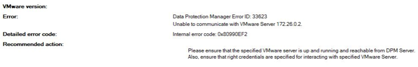

<!-- more -->
皆様こんにちは、Microsoft Azure Backup ＆ Recovery Services サポートです。

最近 DPM (Data Protection Manager)、MABS (Microsoft Azure Backup Server) を使用し、オンプレミス環境や AVS(Azure VMware Solution) 環境にある VMWare 仮想マシンをアックアップする需要が多くなっています。
DPM と MABS を VMWare vCenter Server に初期接続する時に、下記のような「VMWare Server と通信できない」エラーが発生した問い合わせがあります。


## 目次
-----------------------------------------------------------
[1. 【事象 Error ID 33623】](#1)
[2. 【対処方法】](#2)
-----------------------------------------------------------


## 1. 【事象】<a id="1"></a>
>Error ID 33623 
>Internal error code 0x80990EF2 

*** ＜DPMコンソールのエラー画面サンプル＞ ***



上記エラーを解消するためのサポートチケットを起票する前に、まず下記 2 つの設定を確認することを推奨します。

## 2. 【対処方法】<a id="2"></a>
1. vCenter Server 6.7 以降の場合、DPM、MABS サーバーにで TLS 1.2 を有効にします。

TLS 1.2を有効化する方法について下記ドキュメントをご参照ください。
 MABS向けのドキュメント：
https://docs.microsoft.com/ja-jp/azure/backup/backup-azure-backup-server-vmware#vmware-vsphere-67-and-70

DPM向けのドキュメント：
https://docs.microsoft.com/ja-jp/system-center/dpm/back-up-vmware?view=sc-dpm-2019#vmware-vsphere-67

### 実施ステップのサンプル
①以下のテキストをコピーして、.txt ファイルに貼り付けます。
```
Windows Registry Editor Version 5.00

[HKEY_LOCAL_MACHINE\SOFTWARE\WOW6432Node\Microsoft\.NETFramework\v2.0.50727]
"SystemDefaultTlsVersions"=dword:00000001
"SchUseStrongCrypto"=dword:00000001

[HKEY_LOCAL_MACHINE\SOFTWARE\WOW6432Node\Microsoft\.NETFramework\v4.0.30319]
"SystemDefaultTlsVersions"=dword:00000001
"SchUseStrongCrypto"=dword:00000001

[HKEY_LOCAL_MACHINE\SOFTWARE\Microsoft\.NETFramework\v2.0.50727]
"SystemDefaultTlsVersions"=dword:00000001
"SchUseStrongCrypto"=dword:00000001

[HKEY_LOCAL_MACHINE\SOFTWARE\Microsoft\.NETFramework\v4.0.30319]
"SystemDefaultTlsVersions"=dword:00000001
"SchUseStrongCrypto"=dword:00000001
```
②そのファイルを EnableTLS12.reg という名前で DPM、MABSサーバーに保存します。

③ファイルをダブルクリックして、レジストリ エントリをアクティブ化します。


2. 下記ドキュメントを参照し、HTTPS 証明書の検証を無効化にして、事象改善されるかを確認します。
 MABS向けのドキュメント：
「HTTPS 証明書の検証の無効化」セッションを参照します。
https://docs.microsoft.com/ja-jp/azure/backup/backup-azure-backup-server-vmware#create-a-secure-connection-to-the-vcenter-server

DPM向けのドキュメント：
「セキュリティで保護された通信プロトコルを無効にする」セッションを参照します。
https://docs.microsoft.com/ja-jp/system-center/dpm/back-up-vmware?view=sc-dpm-2019#configure-dpm-to-protect-vmware

### 実施ステップのサンプル
①以下のテキストをコピーして、.txt ファイルに貼り付けます。
```
Windows Registry Editor Version 5.00

[HKEY_LOCAL_MACHINE\SOFTWARE\Microsoft\Microsoft Data Protection Manager\VMWare]
"IgnoreCertificateValidation"=dword:00000001
```

②そのファイルを DisableSecureAuthentication.reg という名前で DPM、MABS サーバーに保存します。

③ファイルをダブルクリックして、レジストリ エントリをアクティブ化します。


もし上記アクションを実施後でも事象改善しない場合、問い合わせを起票していただければと存じます。
