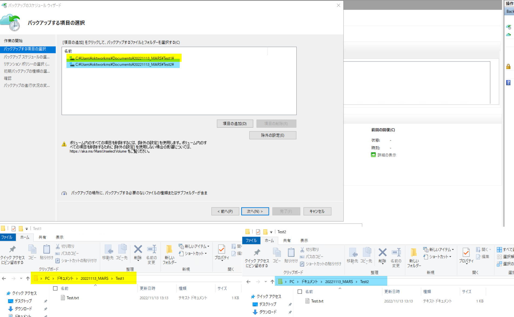
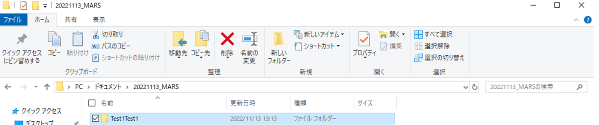
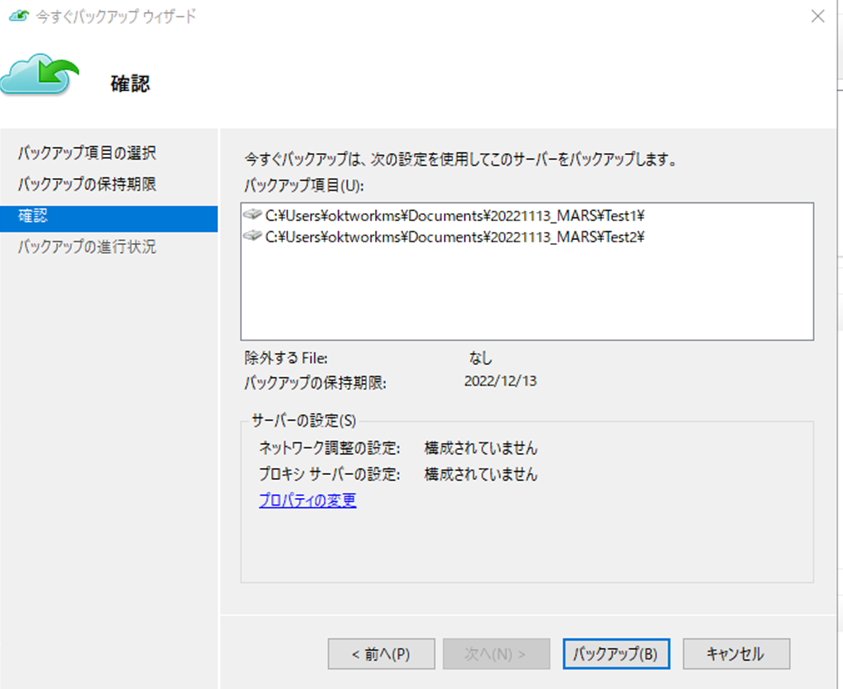
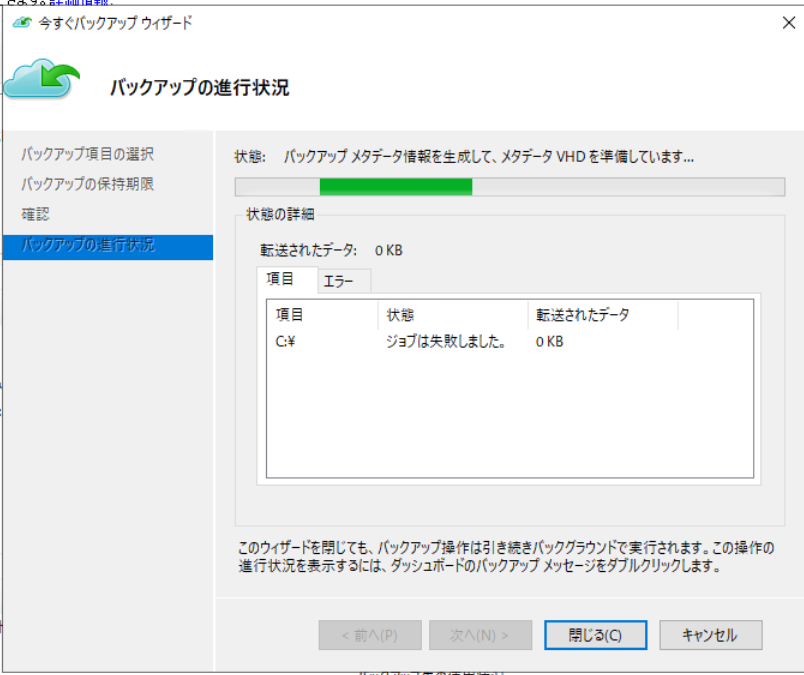
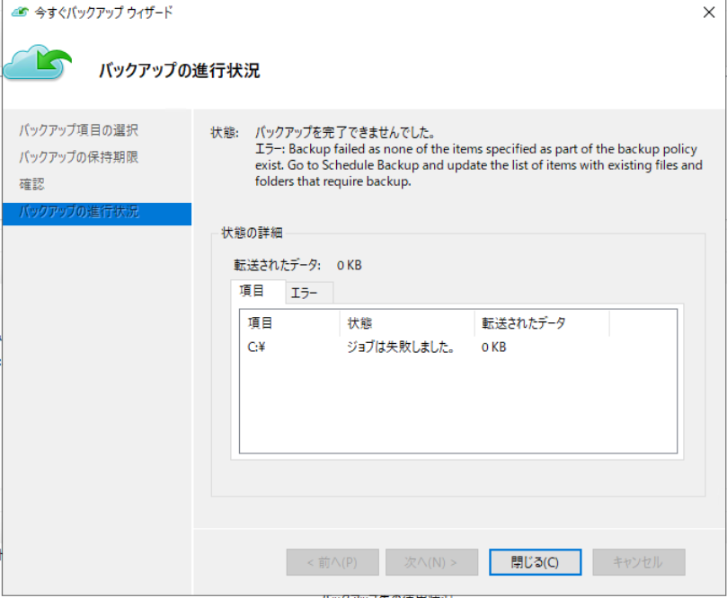
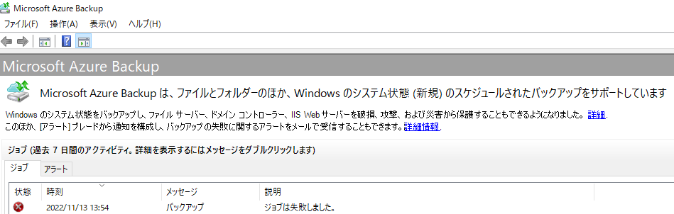
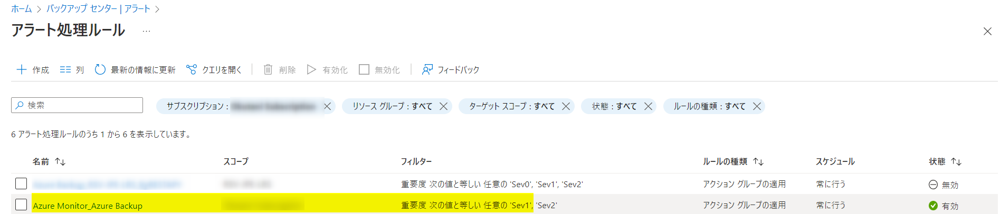
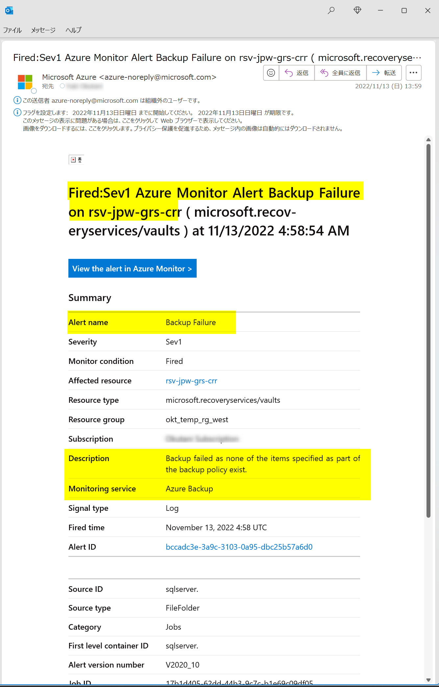

<!-- more -->
皆様こんにちは、Azure Backup サポートの 山本 です。
アラートのテスト等のため "Azure MARS Backup エージェントを利用したバックアップ (以下 MARS バックアップ) を失敗させたい" というお問い合わせをよくいただきます。
今回は、**MARS バックアップ を意図的に失敗させる方法**について、ご案内いたします。

### 意図的に MARS バックアップ エラーを発生させる仕組み
バックアップ対象にフォルダを指定し、バックアップ ポリシーを設定した後、対象のフォルダ名を変更します。
そうすることでバックアップ対象のフォルダがない為にバックアップ ジョブを失敗させます。

### MARS バックアップ を失敗させる方法(手順)
* 以下は MARS エージェントがインストールされているマシン上での作業となります。

#### 1. MARSエージェントのスケジュール バックアップ設定よりテスト用のフォルダをバックアップ対象として選択し、設定します。
その他の設定は任意の設定で問題ございません。
(画像では Test1 フォルダを対象として選択しています)

#### 2. 上記でバックアップ対象としたフォルダ名を変更します。
(画像では Test1 フォルダを Test1Test1 フォルダと変更しました)

#### 3. 今すぐバックアップを実行します。
バックアップ期間は任意の期間で問題ありません。
確認画面にて、手順 1 で設定した名前変更前のフォルダが指定されてることを確認し、バックアップを実施してください。

#### 4. バックアップの失敗のメッセージが現れることを確認してください。

###　Azure Monitor を使用した組み込みのアラート メール通知例
MARS バックアップを構成している Recovery Services コンテナーをスコープに含めた Azure Monitor を使用した組み込みのアラートを構成している場合、下図のようなメール通知が発報されます。

・ジョブの失敗のシナリオに対して Azure Monitor のアラートを有効にする
　https://learn.microsoft.com/ja-jp/azure/backup/backup-azure-monitoring-built-in-monitor?tabs=recovery-services-vaults#turning-on-azure-monitor-alerts-for-job-failure-scenarios

以上で MARS バックアップ を意図的に失敗させる方法に関しましてのご説明は終了となります。
ぜひお試しいただければと思います。

 （補足）その他の Azure Backup を意図的に失敗させる手順は下記にてご紹介しております。

・Azure VM Backup を意図的に失敗させる方法 | Japan CSS ABRS Support Blog !! (jpabrs-scem.github.io)
　https://jpabrs-scem.github.io/blog/AzureVMBackup/How_to_fail_VM_backup/

・Azure VM Backup のデータ転送フェーズを意図的に失敗させる方法 | Japan CSS ABRS Support Blog !! (jpabrs-scem.github.io)
　https://jpabrs-scem.github.io/blog/AzureVMBackup/How_to_fail_ttv/

・Azure Files Backup を意図的に失敗させる方法 | Japan CSS ABRS Support Blog !! (jpabrs-scem.github.io)
　https://jpabrs-scem.github.io/blog/AzureFilesBackup/How_to_fail_AFS_backup/

・Azure Disk Backup を意図的に失敗させる方法 | Japan CSS ABRS Support Blog !! (jpabrs-scem.github.io)
　https://jpabrs-scem.github.io/blog/AzureDiskBackup/How_to_fail_Asure_Disk_backup/
