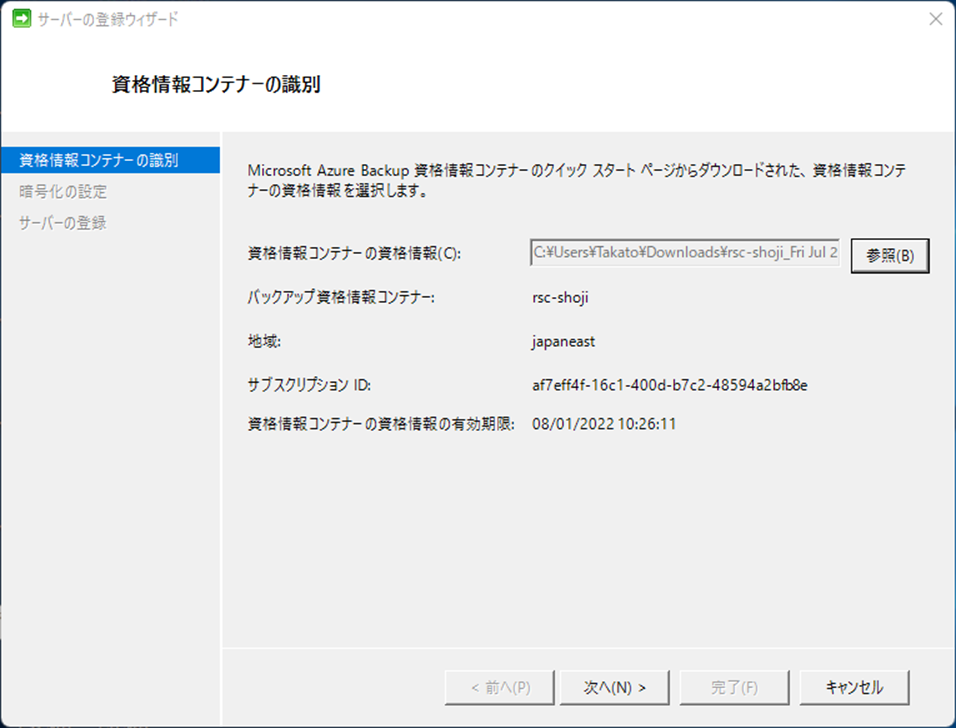
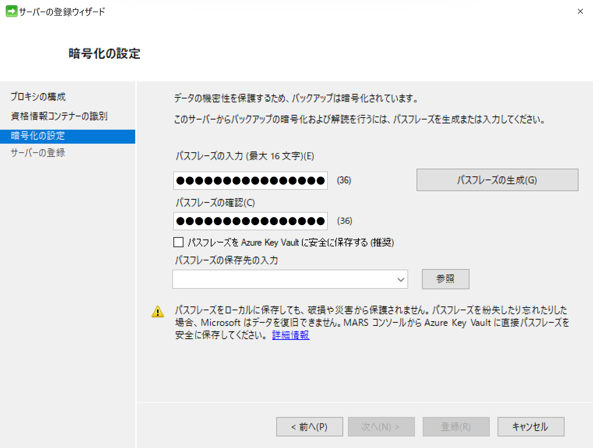

<!-- more -->
皆様こんにちは、Azure Backup サポートの 山本 です。
今回は MARS エージェントの再インストール手順をお伝えさせていただきます。

なお、なんらかの不具合が発生している場合の MARS エージェントの再インストールは **上書きインストールではなく、必ず 一度アンインストールした上**で実施いただくようお願いいたします。
例えば、ネットワーク構成などを変えていないのに、MARS コンソールが立ち上がらなくなった (正常に動作しなくなった) 場合やバックアップ が失敗するようになった等の場合は再インストールが有効な対処策であることが多くございます。

特に証明書関連のエラーの場合再インストールの前後で証明書に変化があったかご確認いただけますと幸いです。
その際は下記記事を参考にして作業前後で証明書をご確認ください。
 ・4.4 各種証明書の確認証跡 - 4. MARS Backup エージェントを利用したバックアップ の障害調査に必要なログ
https://jpabrs-scem.github.io/blog/AzureBackupGeneral/RequestForInvestigating/#4-4

>【注意】MARS エージェントの再インストール後も以前のスケジュールバックアップ設定や復元ポイントを利用可能ですが、その際には以前 MARS エージェントのサーバー登録時に利用したパスフレーズが必要となりますので、再インストール時は **パスフレーズがお手元にあることを確認の上**、作業を実行してください。

# 目次
-----------------------------------------------------------
[1. MARS エージェントのアンインストール](#1)
[2. MARS エージェントの(再)インストール](#2)
[3. サーバーの登録](#3)
[4. 関連公開情報](#4)
-----------------------------------------------------------

##  1.MARS エージェントのアンインストール
###  1-1. MARSバックアップ対象のマシンにログインします
 下記のフォルダーをコピーして任意の別の場所に退避しておきます。
 正常に再インストールが完了した際にはこの退避したフォルダは不要です。

>（対象パス）C:\Program Files\
>（コピーする対象のフォルダー）Microsoft Azure Recovery Services Agent

###  1-2. windows ボタン + r を押し、”appwiz.cpl” と入力し、「OK」＞「プログラムのアンインストールまたは変更」画面を開きます

 
###  1-3.「Microsoft Azure Recovery Services Agent」を右クリックし、「アンインストールと変更」をクリックします

 
###  1-4. MARSアプリケーション のアンインストール ウィザードが開くため、「アンインストール」をクリックします

 
###  1-5. アンインストールされたことを確認してください。

##  2. MARS エージェントの(再)インストール
###  2-1. Azure Portal > 該当のRecovery Services コンテナー > 設定 – バックアップ より以下を選択し、”インフラストラクチャの準備” をクリックしてください。
> ワークロードはどこで実行されていますか？：オンプレミス
> 何をバックアップしますか？：ファイルとフォルダー

###  2-2. “Windows Server または Windows クライアント用エージェントのダウンロード” をクリックしてください。
  *最新版のMARS エージェントインストーラーがダウンロードされます。

###  2-3. ダウンロードしたインストーラーを該当のサーバーにて実行してください。

###  2-4. セットアップ ウィザードが開きますので、ウィザードの案内に従い、MARS エージェントをインストールしてください。

###  2-5. インストール完了後、”登録処理を続行” をクリックしてください。

###  2-6. サーバーの登録ウィザードが開きますので、次の手順に進んでください。

##  3. サーバーの登録
###  3-1. 手順 2-2 の画面にて ”最新のRecovery Services Agent を既にダウンロードしたか、使用している” にチェックし、ダウンロードをクリックしてください。
*Recovery Services コンテナーの資格情報がダウンロードされます。

### 3-2. ダウンロードした資格情報を該当のサーバーに配置してください。

### 3-3. 手順2-6の画面にて手順3-2でダウンロードした資格情報を選択し、”次へ” をクリックしてください。

### 3-4. 以前登録したパスフレーズを入力し、パスフレーズを保存する任意の場所を選択して、”登録” をクリックして登録を完了してください。

## 4. 関連公開情報
・MARS エージェントのダウンロード
https://docs.microsoft.com/ja-jp/azure/backup/install-mars-agent#download-the-mars-agent

・サーバーにインストールされている MARS エージェントの更新
https://docs.microsoft.com/ja-jp/azure/backup/upgrade-mars-agent#update-the-mars-agent-installation-on-the-server

・パスフレーズを忘れた場合、復旧できますか?
https://docs.microsoft.com/ja-jp/azure/backup/backup-azure-file-folder-backup-faq#%E5%BE%A9%E5%85%83

本記事の内容は以上となります。