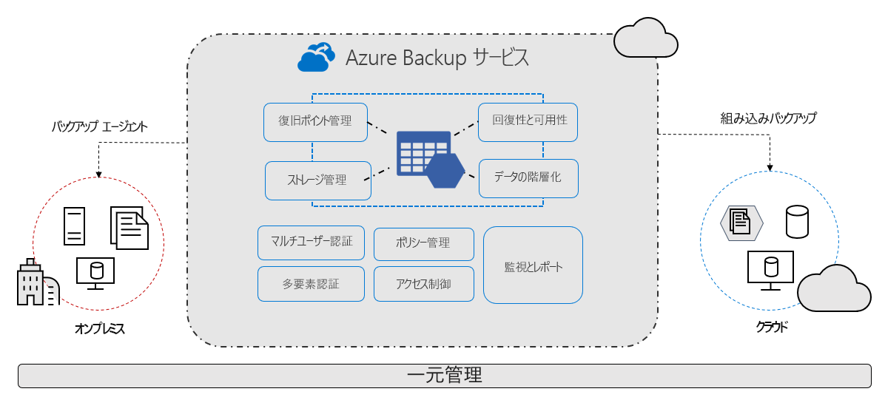
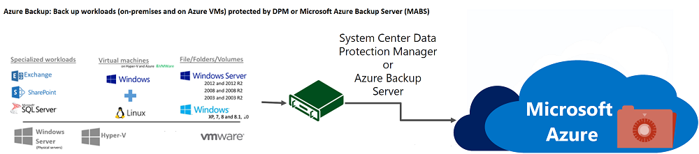
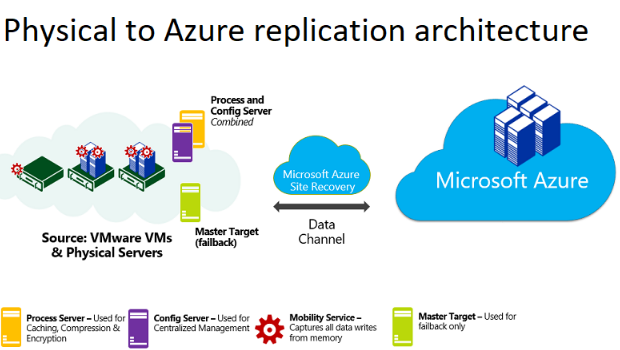
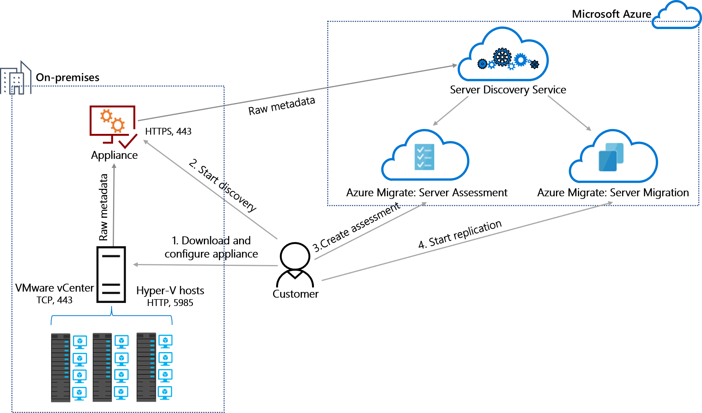
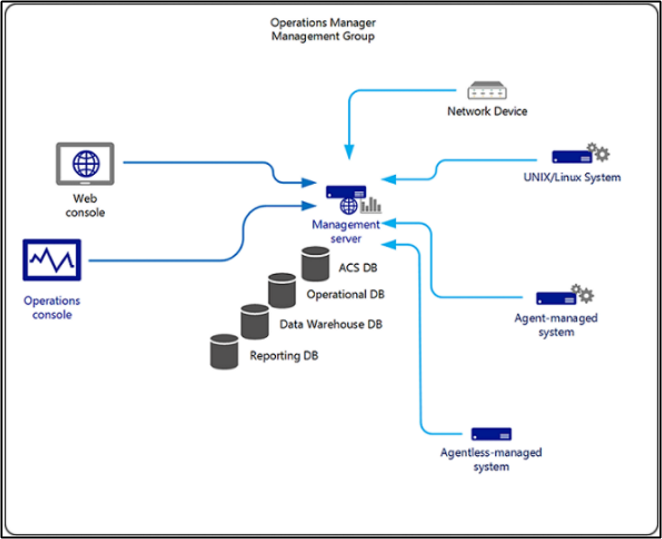

<!-- more -->

我々のチームは文字通り、ABRS と SCEM という二つの領域をカバーしているチームです。
ABRS チーム (Azure Backup and Recovery Service) は主にデータ保護ソリューションを提供する技術領域として Azure Backup 、SCDPM / MABS、 Azure Site Recovery 、Azure Migrate、Azure Resource Mover、Movere の技術サポートを担当しています。

また、SCEMチーム (System Center Enterprise Management) は統合運用管理製品群として提供されている System Center という製品群のうち、次の Enterprise Management製品を担当します。
SCOM (System Center Operations Manager), SCVMM (System Center Virtual Machine Manager), SCO (System Center Operations), SCSM (System Center Service manager) の技術サポートを担当しています。

現在は完全にフルリモートで各自家から仕事、(WfH, work from home と呼んでいます) しています。
新しく加入したメンバーも多いチームですが、フルリモートであっても Teams などをフル活用してメンバー間のコミュニケーションは活発に行われており、チーム全員楽しく新しいチャレンジができています。
以下に当チームの代表的な製品をご紹介します。

• Azure Backup
https://docs.microsoft.com/ja-jp/azure/backup/
• DPM/MABS
https://docs.microsoft.com/ja-jp/system-center/dpm/dpm-overview
https://docs.microsoft.com/ja-jp/azure/backup/backup-support-matrix-mabs-dpm
• Azure Site Recovery
https://docs.microsoft.com/ja-jp/azure/site-recovery/
• Azure Migrate
https://docs.microsoft.com/ja-jp/azure/migrate/
• System Center 製品群　
https://docs.microsoft.com/ja-jp/system-center/

#### Azure Backup ってどんな製品？
Azure Backup はデータをバックアップし、それを Microsoft Azure クラウド から回復するための製品です。 
例えば、Azure VM, Azure Files, Azure Managed Disks, Azure BLOB などのバックアップを行うことが出来ます。
Azure VM のバックアップでは、ディスクのスナップショットを取得し、取得したスナップショットを Recovery Services コンテナーにデータ転送することで実現しています。
また、取得したスナップショットから復元を行うこともできます。

#### DPM/MABS ってどんな製品？
DPM (System Center Data Protection Manager) と MABS（Microsoft Azure Backup Server) は、多様な保護対象をバックアップと回復するための製品です。
バックアップされたデータはローカル・ディスクだけではなく、Microsoft Azure クラウドにも保存できます。
主に下記のワークロードを保護する機能を提供しています。
・Microsoft ワークロードのアプリケーション (SQL Server、Exchange、SharePoint など)
・Windows オペレーティング システムを実行するコンピューターのファイル、フォルダー、ボリューム
・Windows オペレーティング システムを実行するコンピューターのシステム状態のバックアップまたは完全なベア メタル バックアップ
・Windows または Linux を実行する Hyper-V 仮想マシンと VMWare 仮想マシン

#### Azure Site Recovery ってどんな製品？
Azure Site Recovery (ASR) は、データの保護を行うことで、メンテナンスや災害などによるシステム停止の際に、お客様のビジネス継続性の確保とディザスター リカバリー (BCDR) を可能とするための製品です。システム停止時には、プライマリ サイトからセカンダリ サイト へフェール オーバーすることで、ビジネス継続性を確保することができます。
主に以下の環境のデータの保護を行うことができます。
・Azure プライマリ リージョン から Azure セカンダリ リージョン への保護
・オンプレミス VM / 物理サーバー サイト から Azure サイト への保護

オンプレミス VM / 物理サーバー サイト から Azure サイト への保護の図：

#### Azure Migrate ってどんな製品？
Azure Migrate は、オンプレミスのアプリとワークロード、およびプライベート/パブリック クラウド VM の検出、評価、および Azure への移行を追跡するための中央ハブであり、Azure Migrate ツールのほか、サードパーティの ISV オファリングが用意されています。
Azure Migrate を使用することでオンプレミスの VMware VM、Hyper-V VM、物理サーバー、その他の仮想化された VM、データベース、Web アプリ、仮想デスクトップの評価と移行を一元化することができます。

#### System Center ってどんな製品？
今回は System Center 製品群のうち、SCOM (System Center Operations Manager) に関してご説明させていただきます。
Microsoft System Center の 1 つのコンポーネントである Operations Manager は、1 つのコンソールから多数のコンピューターのサービス、デバイス、および操作を監視できるソフトウェアです。
Windows Server や Linux コンピューターなどのエージェント側の死活監視からログ情報/イベント情報の監視、アラート発砲まで一元的に機能をご提供します。

