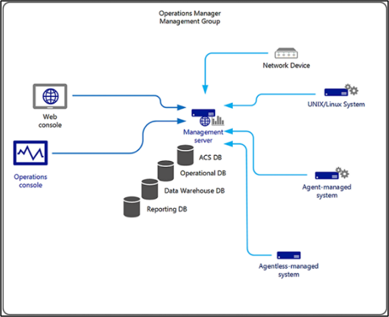
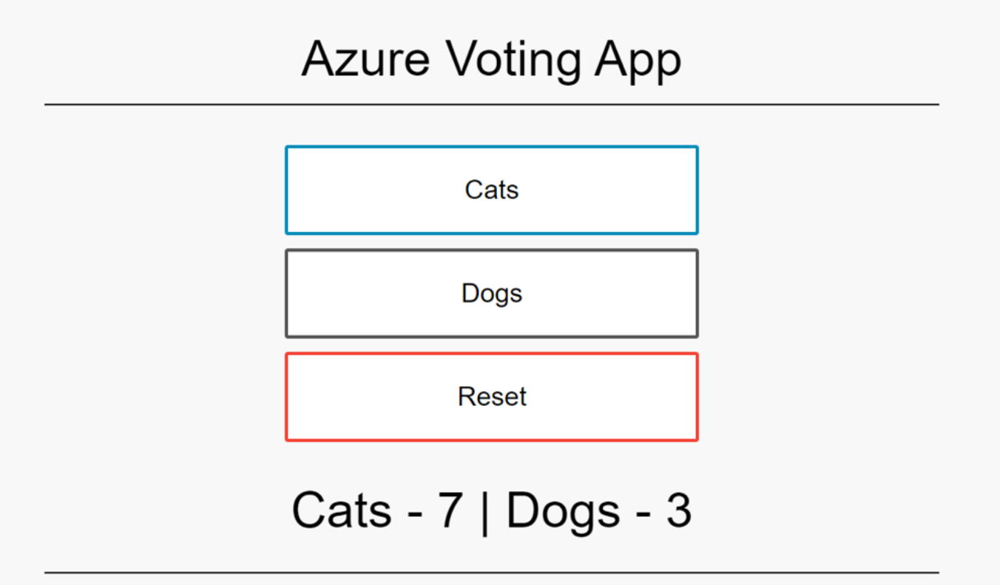

<!-- more -->
#### ABRS & SCEM チームについて
ABRS (Azure Backup and Recovery Service) として Azure Backup 、DPM/MABS、 Azure Site Recovery 、Azure Migrate 、System Center の各製品の技術サポートをしているチームです。
現在は完全にフルリモートで各自家から仕事 (WfH, work from home と呼んでいます) しています。

• Azure Backup
https://docs.microsoft.com/ja-jp/azure/backup/
• DPM/MABS
https://docs.microsoft.com/ja-jp/system-center/dpm/dpm-overview
https://docs.microsoft.com/ja-jp/azure/backup/backup-support-matrix-mabs-dpm
• Azure Site Recovery
https://docs.microsoft.com/ja-jp/azure/site-recovery/
• Azure Migrate
https://docs.microsoft.com/ja-jp/azure/migrate/
• SCOM
https://docs.microsoft.com/ja-jp/system-center/scom/


#### Azure Backup  ってどんな製品？
Azure Backup はデータをバックアップし、それをMicrosoft Azureクラウドから回復するための製品です。 
例えば、Azure VM, Azure Files, Azure Managed Disks, Azure BLOB などのバックアップを行うことが出来ます。
Azure VM のバックアップでは、ディスクのスナップショットを取得し、取得したスナップショットを Recovery Services コンテナーにデータ転送することで実現しています。
また、取得したスナップショットから復元を行うこともできます。


#### SCOM ってどんな製品？
Microsoft System Center の 1 つのコンポーネントである Operations Manager は、1 つのコンソールから多数のコンピューターのサービス、デバイス、および操作を監視できるソフトウェアです。
Windows Server や Linux コンピューターなどのエージェント側の死活監視からログ情報/イベント情報の監視、アラート発砲まで一元的に機能をご提供します。


-----------------------------------------------------------
<!-- 文字修飾 -->

**太字**

~~訂正せん~~

*斜め文字*

<!-- 引用 -->

> 引用
>> 引用

<!-- 見出し -->

## 見出し (大)
### 見出し (中)
#### 見出し (小)

<!-- リスト -->

- リスト
   - リスト
   - リスト
- リスト

<!-- 数字リスト -->

1. 数字リスト
   1. 数字リスト
   2. 数字リスト
2. 数字リスト
3. 数字リスト

<!-- 区切り線 -->

---

<!-- リンク -->

[Japan Azure IaaS Core Support Blog](https://jpaztech.github.io/blog/)

<!-- 画像 (リポジトリ内ファイルを参照 -->



<!-- 画像 (外部 URL を参照) -->


<!-- コード ブロック -->

```CMD
net stop rdagent
net stop WindowsAzureGuestAgent
net stop WindowsAzureTelemetryService
```

<!-- 表 -->

| 見出し | 見出し |
| ---- | ---- |
| セル | セル |
| セル | セル |

<!-- ノート -->

> [!NOTE]
> THIS IS NOTE
> `[!NOTE]` と書くと `Note` になります。
> これだけ MS 公式ドキュメントと異なります。 (公式ドキュメントだと `NOTE` も `注意` に変換される…)

<!-- ヒント -->

> [!TIP]
> THIS IS TIP
> `[!TIP]` とかくと `ヒント` になります。

<!-- 重要 -->

> [!IMPORTANT]
> THIS IS IMPORTANT
> `[!IMPORTANT]` とかくと `重要` になります。

<!-- 注意事項 -->

> [!CAUTION]
> THIS IS CAUTION
> `[!CAUTION]` と書くと `注意事項` になります。

<!-- 注意 -->

> [!WARNING]
> THIS IS WARNING
> `[!WARNING]` と書くと `警告` になります。

