<!-- more -->
こんにちは！ABRS チームの山本です。
今日は、私たちのチームがどのように働いているのか、少しでも皆さんにイメージしていただき、興味をもっていただけるよう、普段の働き方や仕事環境について紹介いたします。
現在は全メンバーがリモートワークをしており、首都圏以外にも北海道や大阪在住、またUS在住のメンバーまで在籍しております。

## 目次
-----------------------------------------------------------
[1. よくある仕事の流れ](#1)
[2. とある日の一日](#2)
[3. デスク ツアー！](#3)
[4. リモート ワークの魅力](#4)
[5. 関連記事](#5)
-----------------------------------------------------------

### 1. よくある仕事の流れ
Microsoft のサポート エンジニアはお客様から起票いただいたサポート リクエストを通してお客様の抱える問題を解決するための技術支援を行います。
案件の受付からクローズまで基本的には担当するメンバーがオーナーシップを持って対応します。
基本的な案件対応の流れとしては、案件の受付 → 調査方針の決定 → 発生している問題の調査 → 回答、事象の解消を確認 → クローズ(対応終了) です。
案件の受付から、概ね 14 日程度でクローズとなります。
各エンジニアは 10 ~ 20 件ほどの案件を担当として受け持ち、また同時並行で案件対応を進めていきます。また他にも公開ドキュメントの修正やこうしたブログの執筆も行っております。

このように記載すると 1 つの案件を最初から最後まで自分ひとりで対応しなければいけないように感じるかもしれません。
しかし、実際には同じチームのメンバーや、その他の Azure サポート チームのメンバーと非常に密に連携しながら仕事を進めています。
クラウド サービスでは、新しい機能の追加や機能の改修が日常的に行われており、もはや一人のスーパー エンジニアが何でも知っている、という時代ではなくなっています。
言い換えれば、新しい機能や未知の問題に直面したとき、あなたがその問題の第一人者です。
また、事例の無いお問い合わせを担当するとワクワクするようになります。

このような状況から、各案件でオーナーシップをとる担当者がいるものの、実際には色々なメンバーと支援をし合いながら調査を行っています。

### 2. とある日の一日 

9:00 - サポート窓口が開きます。
業務を開始！まずはメール チェックし、今日一日のタスクの洗い出し。

-----------------------------------------------------------
9:30 - チームの朝会に参加します！
チーム全体への共有事項の展開や、サポート案件対応で困ったポイントを相談します。

-----------------------------------------------------------
10:00 - 新規案件対応。
その日に新しくお問い合わせいただいた案件について、お客様へ電話をして対応方針をお客様と相談します。

-----------------------------------------------------------
12:00 - お昼休憩！
家族と一緒にお昼ご飯を食べます！

-----------------------------------------------------------
13:00 - ミーティングに参加します！
チーム ミーティングや他のサポート チームとのミーティングに参加し、打ち合わせを行います。

-----------------------------------------------------------
13:30 - 案件調査を行います。
気合を入れて、時間のかかる調査 (ログの解析、再現テスト) を行います。

-----------------------------------------------------------
15:00 - Coffee Break ミーティングに参加。
Coffee Break ミーティングでは、業務に関連のない雑談もしてリフレッシュ！
コミュニケーションを取るきっかけになり案件対応の相談もしやすくなっているように感じます！

-----------------------------------------------------------
15:30 - 調査を再開します！
サポート窓口が閉まる 17:30 までにお客様へ調査結果を報告できるようラスト スパート！

-----------------------------------------------------------
16:30 - 夕会
一日の進捗を共有したり各メンバの状況をシェア・相談します。

-----------------------------------------------------------
17:30 - サポート窓口が閉まります。
気が済むまで、翌日報告予定の案件の調査や、他メンバーの案件の内容を勉強します。

-----------------------------------------------------------

### 3. デスク ツアー！
実際のメンバーのデスクですので、こちらからメンバーがどのような環境で働いているのか参考になれば嬉しいです！

##### 本記事内唯一の縦置きディスプレイ配置！USキーボード！

##### 女優ライトでミーティングもバッチリ！リアルフォースキーボード！メインPCは自作の光る Desk mini !
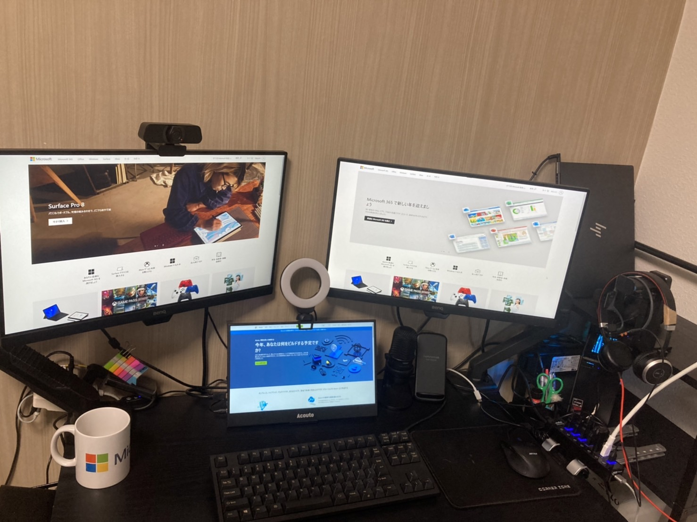

##### トラックボールマウス！！
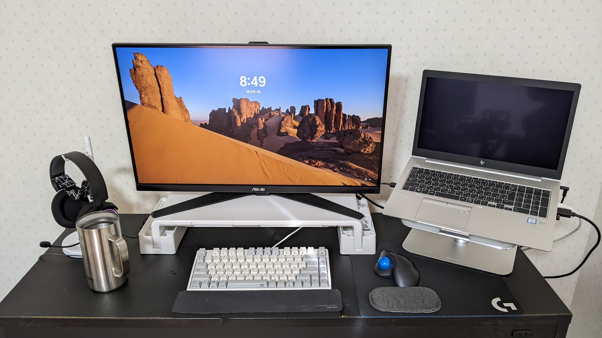

##### モニターの上のぬいぐるみは家族にミーティング中かどうかをお知らせする機能あり！！
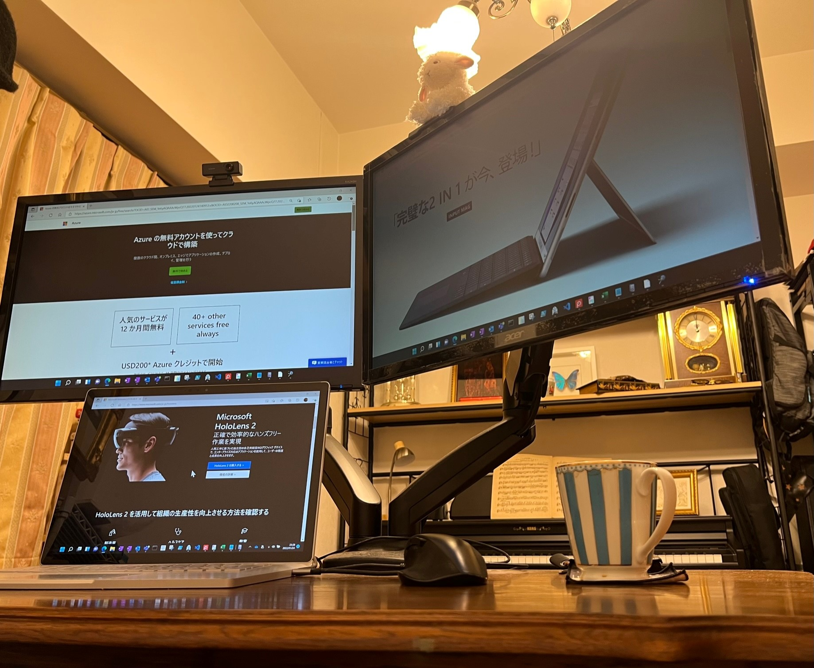

##### ワーキングママ！！
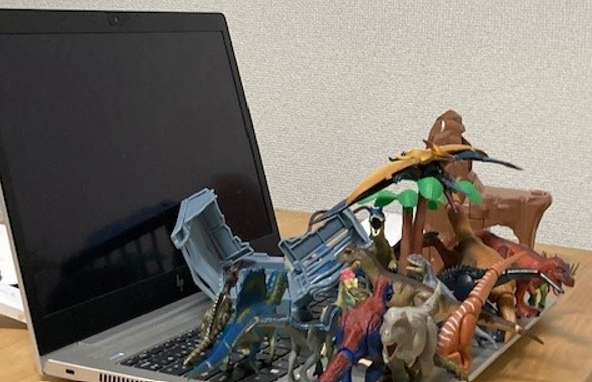

##### シンプル is ベスト.
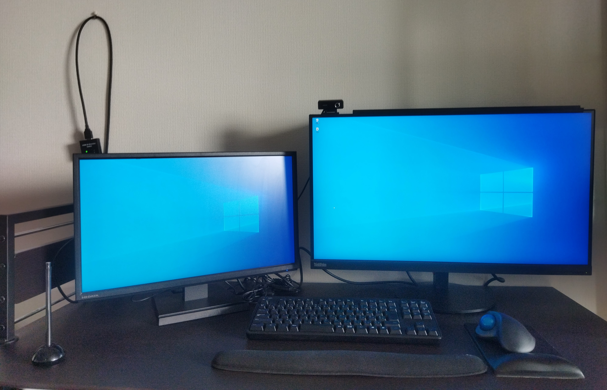

##### キーボードは社割で買いました！カレンダーは星野道夫さんのです。はやくアラスカに行きたいです！
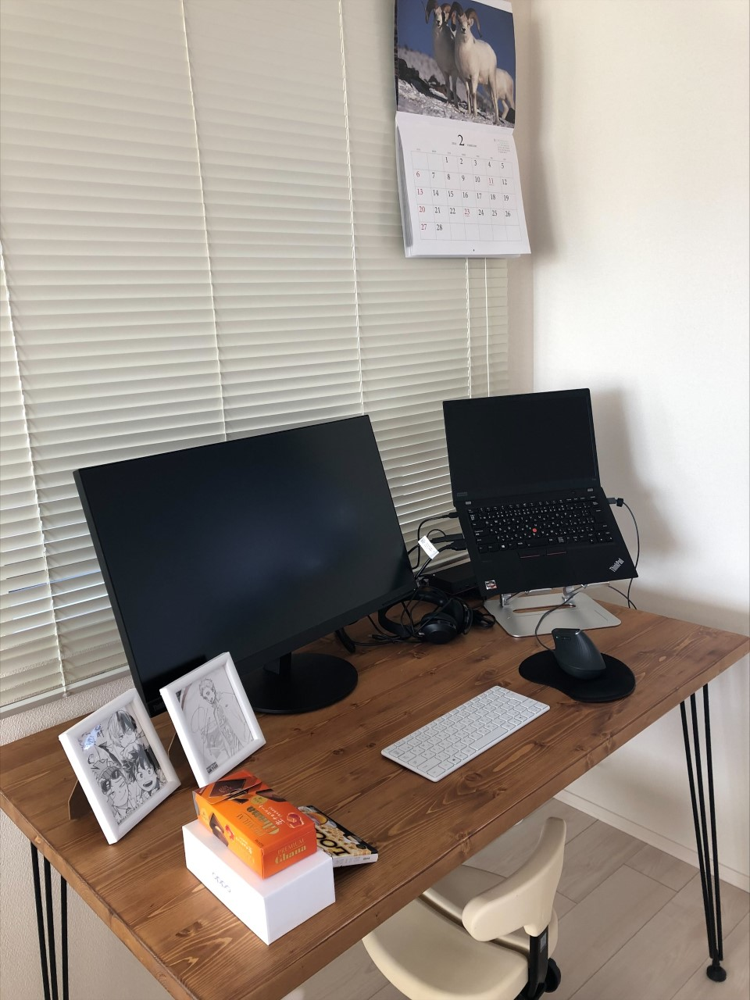

##### 保温機能がついた高性能マグカップ！！
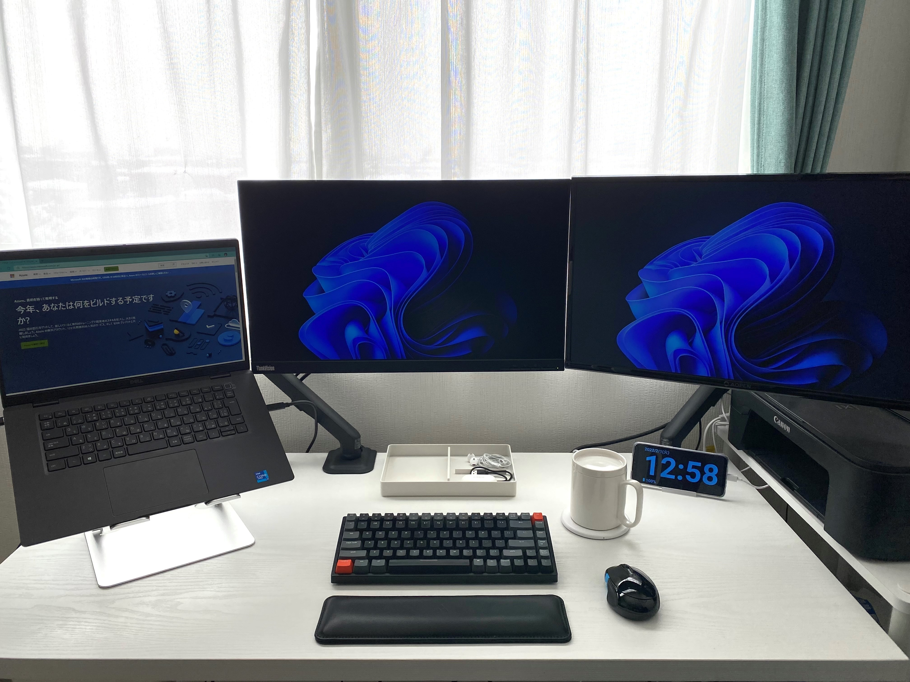

##### ゲーミングな光が So Cool!
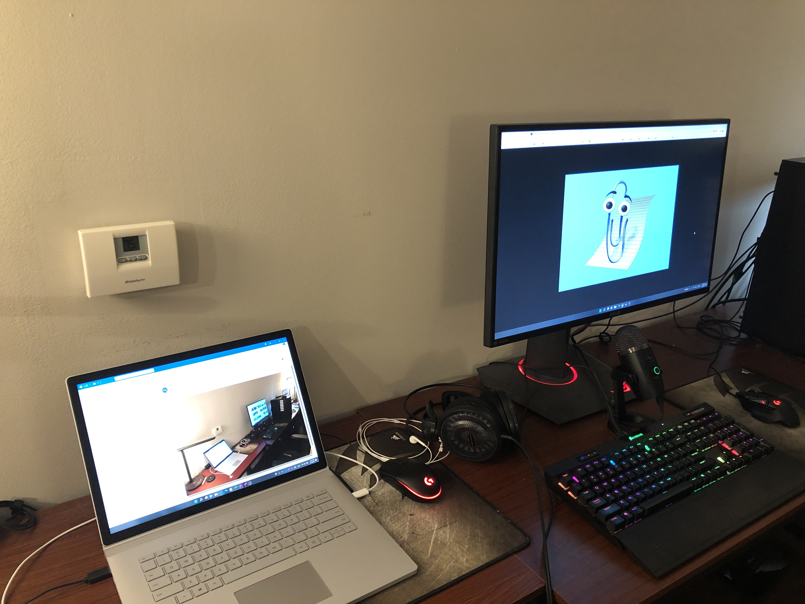

##### チーム唯一の新卒・新入社員！デスクもまだまださらなる進化の可能性を秘めています！！
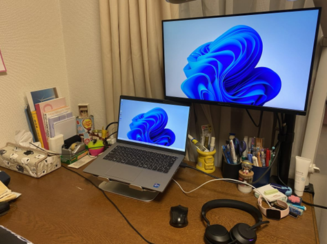

##### タブレット端末も活用してトリプルモニタ環境。インフラエンジニア必携"パケットキャプチャの教科書"をデスク脇に備えています！
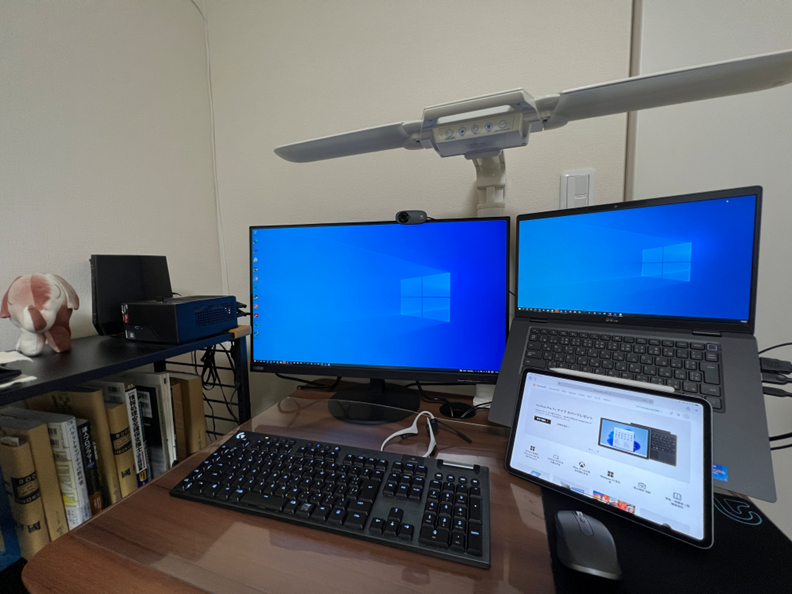

##### いつも愛車を眺めて仕事しています！
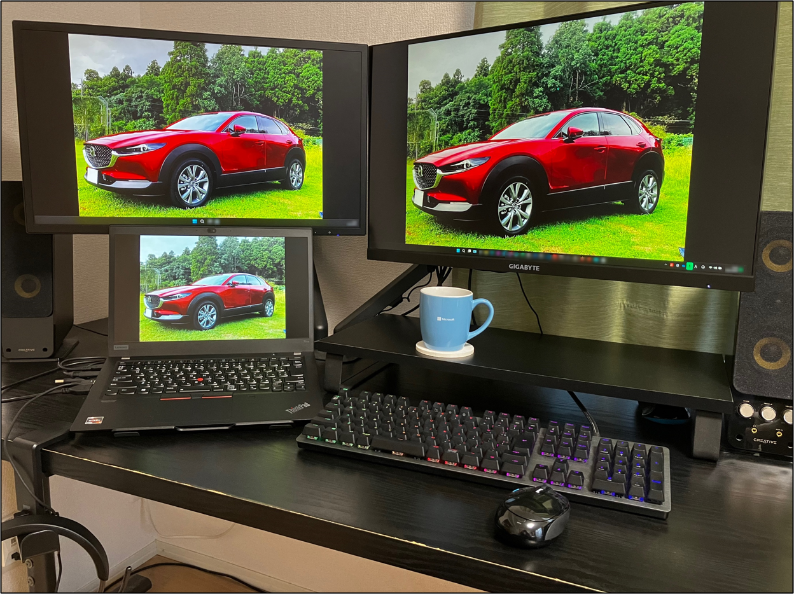

### 4. リモート ワークの魅力
自分好みの環境を作ることが出来る。
睡眠時間が増えます。
自分の時間が取りやすい (通勤なし、すぐ家族に会える) のは非常に良い。
家族との時間が格段に増える。
出勤時間が 0 になるので、自由時間が増える。
自由なタイミングで休憩時間をとって、役所行ったり子供の面倒を見たり出来る。
通勤時間がなくなるので、その分を有意義に使えます。
子供のオムツをかえられる。
宅配の荷物が受け取れる。

### 関連記事
・ABRS & SCEM チームについて
https://jpabrs-scem.github.io/blog/information/team-introduction/